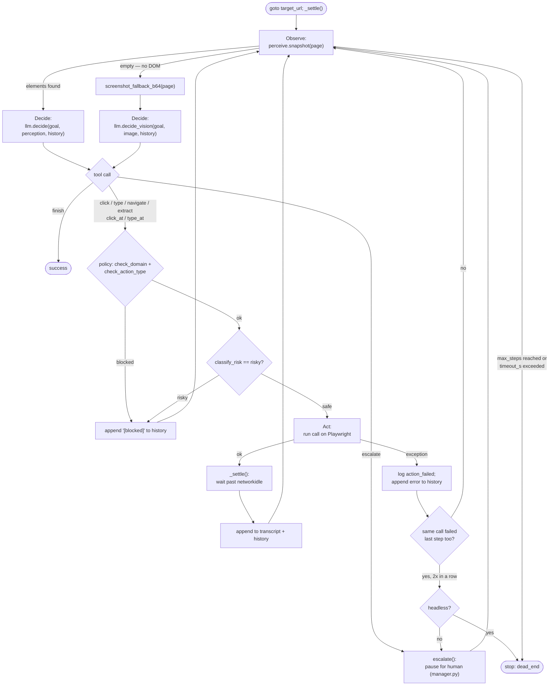

# The discovery loop, explained

`src/agent/loop.py` — `run_discovery()`. This is the only place an LLM drives
the browser; everything downstream (recorder, replay, API) is LLM-free.

## The cycle

Each of up to `max_steps` iterations is **observe → decide → act**:

1. **Observe** — `perceive.snapshot(page)` walks the DOM for interactive
   (and test-id'd read-only) elements. If that comes back empty (no
   accessible DOM at all, e.g. a canvas-drawn control), fall back to a
   **screenshot** instead — this is vision mode.
2. **Decide** — hand the observation to Groq as a tool-calling turn:
   `llm.decide(...)` for the element list, `llm.decide_vision(...)` for the
   screenshot. The model replies with exactly one tool call: `click`/`type`/
   `navigate`/`extract` (DOM mode), `click_at`/`type_at` (vision mode, pixel
   coordinates), or `finish`/`escalate`.
3. **Act** — run that one call against Playwright, append it to the
   `transcript` (the record `recorder.py` later turns into a replayable
   `Capability`), and turn the outcome into a plain-English `history` line
   the model sees next turn.

`finish` ends the loop successfully. `escalate` (or two identical actions
failing back to back — see below) pauses for a human via
`src/escalation/manager.py`.

## Diagram

## Guardrails baked into the loop (not left to the model)

The system prompt asks the model to behave; the loop doesn't trust that
alone — each of these was a real bug caught by running it live, not a
hypothetical:

- **Policy checks before every action** — domain allowlist, action-type
  allowlist, and risk classification (`policy.classify_risk`) block a
  destructive-looking click (e.g. "Delete account") even if the model
  proposes it.
- **Redaction before logging** — `_redact_call_args()` strips a sensitive
  param's value out of the raw tool-call args before it's ever written to
  the evidence log, not just out of the human-readable `history`.
- **`_settle()` after every action** — this target's content can still be
  hydrating a beat after Playwright's `networkidle` fires; settle waits a
  little past idle instead of perceiving a half-drawn page.
- **Try/except around action dispatch** — a live page can make any action
  throw (a modal intercepting a click, a stale element). The loop logs it
  and feeds the error back to the model as a normal turn instead of crashing
  the whole run.
- **Dead-end detection** — the model doesn't reliably follow its own "don't
  retry a failed action" instruction. The loop tracks
  `consecutive_identical_failures` and forces an escalate-or-stop after two
  in a row, rather than hoping the model notices it's stuck.
- **5s default action timeout during discovery** — a wrong guess should fail
  fast (Playwright's normal 30s default would make a bad guess very
  expensive); replay keeps the normal 30s since by then the locator is
  already verified.

## Why vision mode is a separate path, not a branch

`decide()` and `decide_vision()` are different methods (not one method with
an `if vision`) because the request shape genuinely differs — image content
vs. a text element list, and a different tool schema (`click_at(x,y)` vs.
`click(element_index)`). Vision-mode actions are recorded with `coordinates`
instead of an `element` dict, and `recorder.py` turns that into a
`coordinates`-kind locator — the bottom rung of the same locator ranking
replay already uses, not a parallel system.
